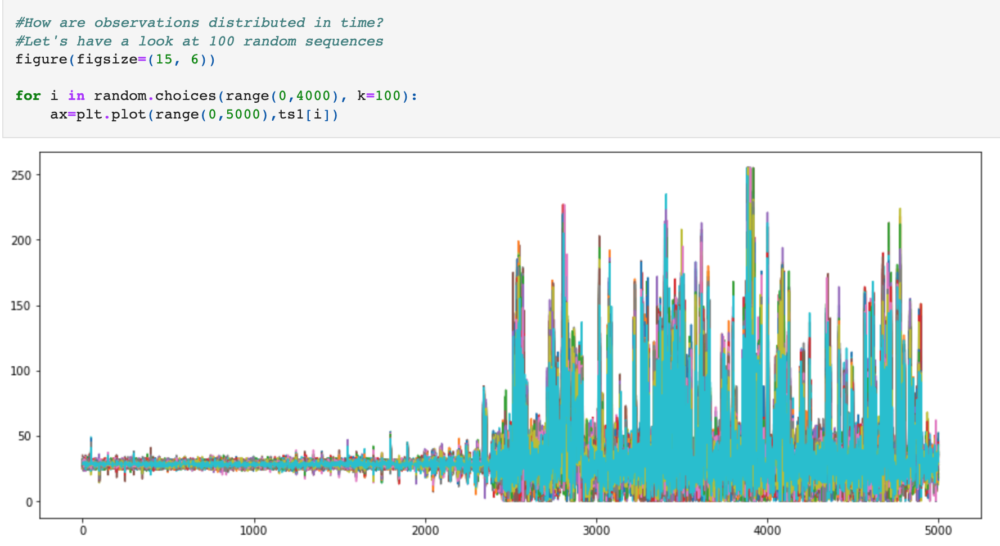

# Task description
1. Create a recurrent neural network in TensorFlow to predict the operating mode of a
wind turbine based on the two time series from the sensors. Before any
implementation, carefully consider what type of approach (sequence-to-vector,
sequence-to-sequence, or encoder-decoder) is most sensible here and how you need to
manipulate the data, given that you have two different time series for each observation. 
Then, make sure that you try out the different layers and elements discussed in class,
such as SimpleRNN, LSTM and Conv1D - while a certain amount of trial and error will be
necessary, it is recommended that you tune your network systematically. Make sure to
record your final validation set accuracy.
Another tool for analyzing time-series data is convolutional neural networks with 2D
convolutional layers. For this to work, time series need to be converted into “images” (matrices
of numbers). The paper
“Convolutional neural network fault classification based on time series analysis for
benchmark wind turbine machine” by Rahimilarki, Gao, Jin, and Zhang (published 2022
in “Renewable Energy” and available through the City-library)
describes how two-dimensional CNNs can be applied to the problem at hand. Consider sections
4 and 5 that depict the process of converting one or multiple time series into “images” used
within a CNN.
2. In your own words, explain why the approach outlined here can help analyze time-series
data and why it might outperform RNNs.
3. Convert the data for use with a CNN. In particular, following the approach outlined in
Scenario 2 (section 5.3 of the paper) and summarized in Figure 18, convert the two time
series corresponding to one wind turbine run into a single (100,100,1) array (i.e., a grayscale image).
4. In TensorFlow, replicate the CNN with three convolutional layers displayed in Figure 12
and train it on your data. Make sure to record your final validation set accuracy.
5. Can you do better by adjusting the CNN? Be creative in your design choices (you might
also consider pre-trained CNN architectures) and record your final validation set
accuracy.
6. Compare the models you have created so far (both RNNs and CNNs) and make a
selection (making sure to justify this). Train that model on a combined training and
validation set and evaluate it on your test set.
